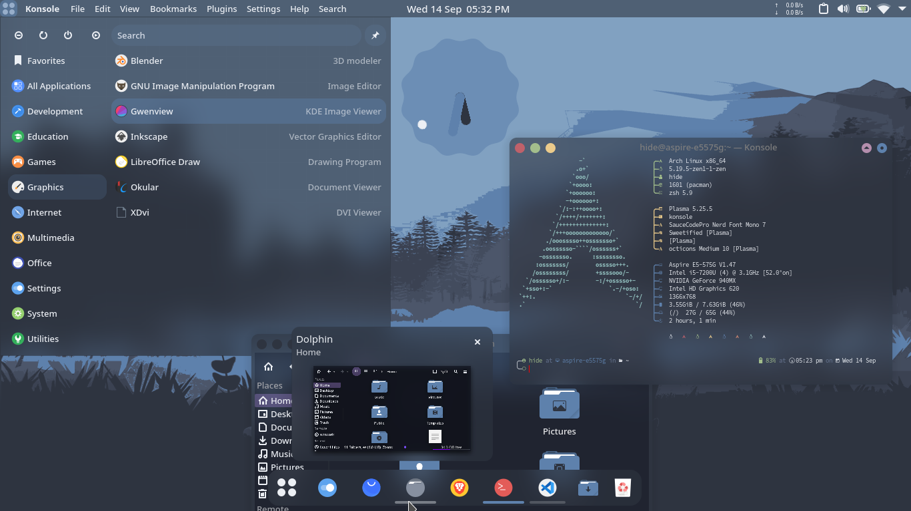
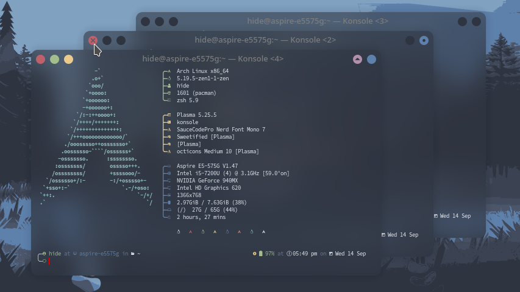
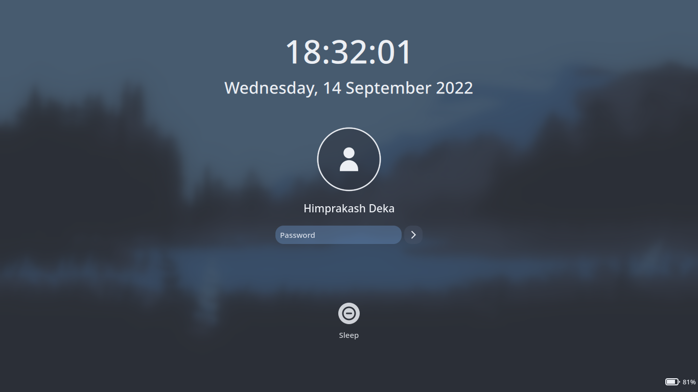
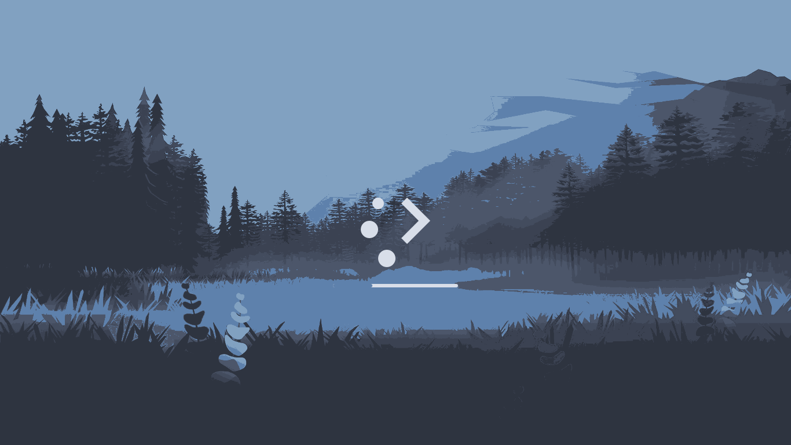

 <a href="https://himdek.com/Utterly-Nord-Plasma/"><h1 align="center">Utterly Nord Plasma Global Theme</h1></a>
 
A Nordic Global theme for Plasma 5

 
 
 
 
 
 
 

  
   
  
  

A Global theme for Plasma 5 with transparency, blur, rounded edges for window borders and widgets, [Tela Circle Nord](https://www.pling.com/p/1359276) icons, [Nord Color Palette](https://www.nordtheme.com/docs/colors-and-palettes) and inspired wallpaper and a reasonable desktop layout with a top panel, dock and a Android 12 like clock widget.

## Key features:

* Rounded edges for all widget elements and window borders
* MacOS inspired desktop layout with a dock and a top panel that contains window buttons and global menu
* [Simple Kickoff](https://github.com/HimDek/Simple-Kickoff-for-Plasma) in top panel and [Better Kicker Dash](https://github.com/HimDek/Better-Kicker-Dash-for-Plasma) in dock
* [Nord Palette](https://www.nordtheme.com/docs/colors-and-palettes) color scheme, wallpaper and Konsole color scheme
* Android 12 like Material You clock widget
* Supports transparency: Go to `System Settings > Workspace Behavior > Desktop Effects` and enable `Blur`, `Background Contrast` and `Tranlucency` for best result.

## Prerequisites:

* Linux based Operating System
* [KDE Plasma 5 Desktop Environment](https://kde.org/plasma-desktop/)

<h1 align="center">Get it from</h1>

  
  
  

<b>NOTE: </b>Installing the global theme package from any one of the above sources will also install all of its required components except the Konsole Color Scheme. Please install the Konsole Color Scheme from <a href="https://store.kde.org/p/1903869">here</a>

<h1 id="gallery" align="center">Gallery</h1>

  

  

  

